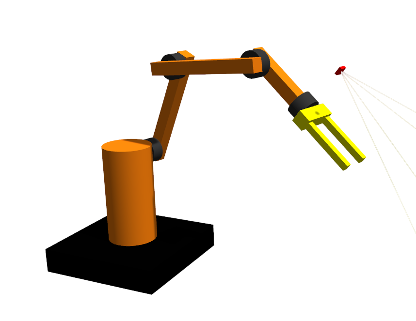

## Project Description

This project features robotic arm simulation using ROS2 and Gazebo. It also provides tools for reinforcement learning, currently only for a reacher task, but there may be a lot more soon.

<p align="center">
  
</p>


## Installation

1. Make sure you have installed ROS2, Gazebo, ros2_controll and ros2_gz_controll. Just follow official guide and you should be good.
2. Clone this repo

    ```git clone https://github.com/onthebox/roboarm```

3. Make ros workspace

    ```colcon build```

4. Install all dependencies with rosdep

    ```rosdep install --from-paths src --ignore-src -r -y```

5. Build workspace

    ```colcon build```

There may be a few missing ros plugins while building, but i'm sure you'll be able to manage them manually.

## Usage

In each new terminal don't forget to source the workspace!

To launch simulation you'll need two separate terminals. Open the first one and execute gazebo launch file:

```ros2 launch roboarm_bringup gazebo.launch.py```

Gazebo window with roboarm model should appear.

In another terminal execute controller launch command:

```ros2 launch roboarm_bringup slider_controller.launch.py```

GUI with sliders should appear and you should be able to controll the robot.

To start training, first provide paths for logging in `src/roboarm_rl/roboarm_rl/train_reacher.py`. Than launch gazebo as well as controller (not slider_controller!) commands in a separate terminals. Now open a new one and type:

```ros2 run roboarm_rl train_reacher.py```

The training process should start. Use `src/roboarm_rl/roboarm_rl/notebooks/plot_graph.ipynb` to monitor the training process.


